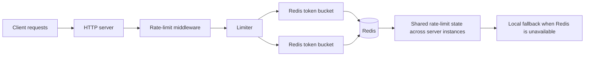

# Distributed Rate Limiter

A Go rate-limiter library with in-memory and Redis-backed bucket implementations. It supports token-bucket, fixed-window, and sliding-window algorithms and provides HTTP middleware for applying limits to requests.

## Features

- Token bucket implementation for single-instance and distributed limits.
- Fixed-window and sliding-window implementations.
- Per-key bucket creation through a factory-based limiter.
- Redis-backed distributed token bucket using an atomic Lua script.
- Local in-memory fallback when Redis is unavailable or times out.
- API-key, IP, and path-based limit keys.
- HTTP response headers and `429 Too Many Requests` responses.
- Configurable per-key limits.
- Go benchmarks for Redis success and fallback paths.

## Current status

The stable, current scope is:

- Distributed IP throttling with the Redis-backed token bucket.
- Distributed API-key throttling with the Redis-backed token bucket.
- In-memory fixed-window and sliding-window implementations.
- HTTP middleware that translates rate-limit results into headers and status codes.

The Redis sliding-window implementation is not yet available. It should be implemented and tested before replacing the in-memory API-key limiter with a Redis sliding-window bucket.

## Architecture



An architecture diagram will be added here when a repository image is available:

```text
docs/architecture.png
```

The Redis-backed token bucket stores the bucket state in Redis. Every server instance therefore reads from and updates the same shared state, allowing the same limit to be enforced across instances.

> When Redis is unavailable or times out, the bucket falls back to a local in-memory bucket. That fallback is local to the current instance and is not shared across server instances.

## Project layout

```text
rate-limiter/
├── cmd/server/         # Example HTTP server and integration
├── middleware/         # HTTP rate-limit middleware
├── *.go                # Library implementations and tests
├── tokenbucket.lua     # Redis token-bucket Lua script
├── go.mod              # Module definition and dependencies
└── go.sum              # Dependency checksums
```

The root package exports the library API. The `cmd/server` package is an executable example that demonstrates how to use the library.

## Installation

Add the library to another Go module:

```bash
go get github.com/Taophycc/distributed-ratelimiter
```

Then import it in application code:

```go
import (
    "time"

    "github.com/Taophycc/distributed-ratelimiter"
)
```

## Main concepts

### Bucket

A bucket implements the `Bucket` interface:

```go
type Bucket interface {
    Allow() Result
}
```

A bucket decides whether a request is allowed and returns the remaining tokens, limit, and reset time.

### Result

```go
type Result struct {
    Allowed   bool
    Remaining int64
    Limit     int64
    ResetAt   time.Time
}
```

### Limiter

The `Limiter` stores buckets by key and uses a factory to create a bucket when one does not exist:

```go
limiter := ratelimit.NewLimiter(func(key string) ratelimit.Bucket {
    return ratelimit.NewTokenBucket(100, time.Second)
})
```

The caller is responsible for choosing an appropriate key. Common choices include:

- Client IP address.
- API key.
- User ID.
- HTTP path.
- A combination of values.

The limiter itself does not make authorization decisions. It only determines whether a request is permitted.

## In-memory token bucket

The token bucket allows requests while tokens are available and refills tokens after a configured interval.

```go
bucket := ratelimit.NewTokenBucket(100, time.Second)

result := bucket.Allow()
```

The implementation is suitable for a single application instance.

## Fixed-window limiter

The fixed-window bucket counts requests within a fixed interval.

```go
bucket := ratelimit.NewFixedWindow(200, time.Minute)
```

The count resets when the window expires.

## Sliding-window limiter

The sliding-window bucket estimates usage across the previous and current windows.

```go
bucket := ratelimit.NewSlidingWindow(200, time.Minute)
```

This is useful when smoother, less bursty limits are required. The current implementation is in-memory and is not Redis-backed.

## Redis-backed token bucket

Create a Redis client and a bucket whose key identifies the rate-limited resource:

```go
client := redis.NewClient(&redis.Options{
    Addr: "localhost:6379",
})

defer client.Close()

bucket := ratelimit.NewRedisTokenBucket(
    client,
    "ratelimit:ip:203.0.113.10",
    100,
    time.Second,
    ratelimit.NewTokenBucket(100, time.Second),
)

result := bucket.Allow()
```

The bucket uses Redis for atomic check-and-decrement behavior through the Lua script in `tokenbucket.lua`.

The following values are returned by the Redis script:

1. Whether the request was allowed.
2. The remaining tokens.
3. The reset timestamp in Unix milliseconds.

## Redis timeout and fail-open behavior

The Redis bucket uses a one-second timeout for each Redis operation.

If Redis returns an error, times out, or cannot be reached, the bucket calls its local fallback bucket:

```go
return r.fallback.Allow()
```

The fallback keeps the application available while Redis is unavailable. This is a fail-open policy. It is not a replacement for a distributed limit when Redis is unavailable.

The server logs Redis health-check failures and continues starting in fail-open mode. See `cmd/server/main.go` for the example startup behavior.

## HTTP middleware

The middleware converts a `Result` into HTTP headers and returns `429 Too Many Requests` when the request is denied.

```go
limiter := ratelimit.NewLimiter(func(key string) ratelimit.Bucket {
    return ratelimit.NewTokenBucket(100, time.Second)
})

handler := middleware.RateLimitMiddleware(
    limiter,
    func(r *http.Request) string {
        return r.RemoteAddr
    },
)(http.HandlerFunc(func(w http.ResponseWriter, r *http.Request) {
    w.WriteHeader(http.StatusOK)
}))
```

The middleware sets:

- `X-RateLimit-Limit`: bucket limit.
- `X-RateLimit-Remaining`: remaining tokens for an allowed request.
- `X-RateLimit-Reset`: Unix timestamp when the limit resets.
- `Retry-After`: seconds until the limit resets for rejected requests.

When a request is denied, the middleware returns HTTP `429` and does not call the next handler.

## Server example

The example server is located at `cmd/server/main.go`.

It creates three limiters:

1. An IP limiter using the Redis-backed token bucket.
2. An API-key limiter using Redis-backed token buckets.
3. A path limiter using the in-memory fixed-window bucket.

The server requires the `X-API-Key` header before allowing requests to reach the handler. The API-key and IP limits are applied to each request in sequence.

Run the server with:

```bash
go run ./cmd/server
```

The server listens on port `8080`.

## Configuration

The configuration structure supports a default rule and per-key overrides:

```go
config := &ratelimit.Config{
    Default: ratelimit.Rule{
        Capacity: 1000,
        Refill:   time.Minute,
    },
    PerKey: map[string]ratelimit.Rule{
        "premium-key": {
            Capacity: 10000,
            Refill:   time.Minute,
        },
        "free-tier-key": {
            Capacity: 50,
            Refill:   time.Second,
        },
    },
}
```

A key can be resolved with:

```go
rule := config.RuleFor("premium-key")
```

## Redis configuration

Set the Redis address with the environment variable:

```bash
export REDIS_ADDR=localhost:6379
```

The environment variable is used by the benchmarks and by the example server when you configure it separately.

Redis must be available for the distributed benchmark and the Redis-backed limiter to perform the full atomic limit check.

## Running tests

Run the complete test suite:

```bash
go test -count=1 ./...
```

Run an individual test:

```bash
go test -run '^TestRedisTokenBucket_DistributedConcurrency$' -v .
```

Tests require a reachable Redis instance for the Redis-specific tests. When Redis is unavailable, those tests are skipped.

## Running benchmarks

Run the Redis success benchmark:

```bash
go test -run '^$' -bench '^BenchmarkRedisTokenBucket_Allow$' -benchmem -count=1 .
```

Run the fallback benchmark:

```bash
go test -run '^$' -bench '^BenchmarkRedisTokenBucket_Allow_Fallback$' -benchmem -count=1 .
```

Run all benchmarks:

```bash
go test -run '^$' -bench . -benchmem -count=1 .
```

### Benchmark output

- `ns/op`: average time per operation.
- `B/op`: average bytes allocated per operation.
- `allocs/op`: average heap allocations per operation.
- `-4` in the benchmark name indicates the benchmark ran using four logical CPUs.

The benchmark result must be interpreted as a local measurement. Network latency, Redis server load, machine performance, and connection pooling can change the result.

## Redis benchmark behavior

The successful Redis benchmark:

1. Creates one shared Redis token bucket.
2. Starts multiple benchmark goroutines.
3. Calls `Allow()` concurrently.
4. Measures the Redis and Lua-script request path.
5. Reports elapsed time and allocations.

The fallback benchmark deliberately uses an unreachable Redis address and measures the timeout and in-memory fallback path.

## Important limitations

- The Redis token bucket has a one-second request timeout.
- Redis failures use the local fallback, which is a fail-open policy.
- A fallback is not a distributed limit and is not shared across application instances.
- The Redis sliding-window implementation is not yet available.
- The fixed-window and sliding-window implementations are local and are not suitable for multi-instance distributed limits.
- The current API does not provide a configurable Redis timeout, health-check policy, or metrics collector.
- The example server uses a hard-coded Redis address and port.
- The `Retry-After` value is derived from the bucket reset time.

## Future work

Planned improvements include:

- A Redis sliding-window bucket.
- Configurable Redis timeout and fallback policy.
- Structured metrics for fallback, timeout, allowed, and rejected requests.
- Separate configurable rate-limit policies for different endpoints and clients.
- Production configuration through environment variables or a configuration file.
- Tests for the middleware’s headers and status codes.
- A common Redis key strategy for API-key, IP, and path limits.
